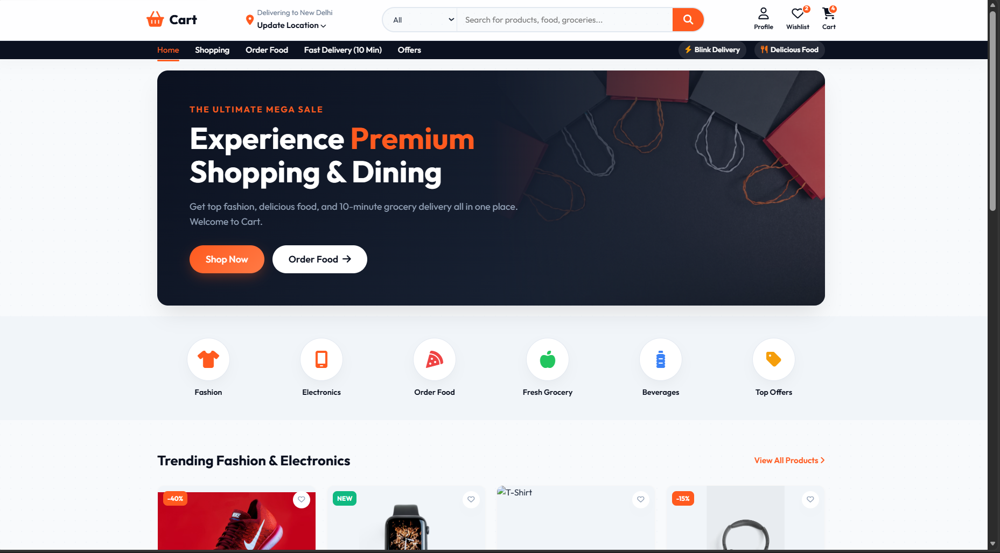
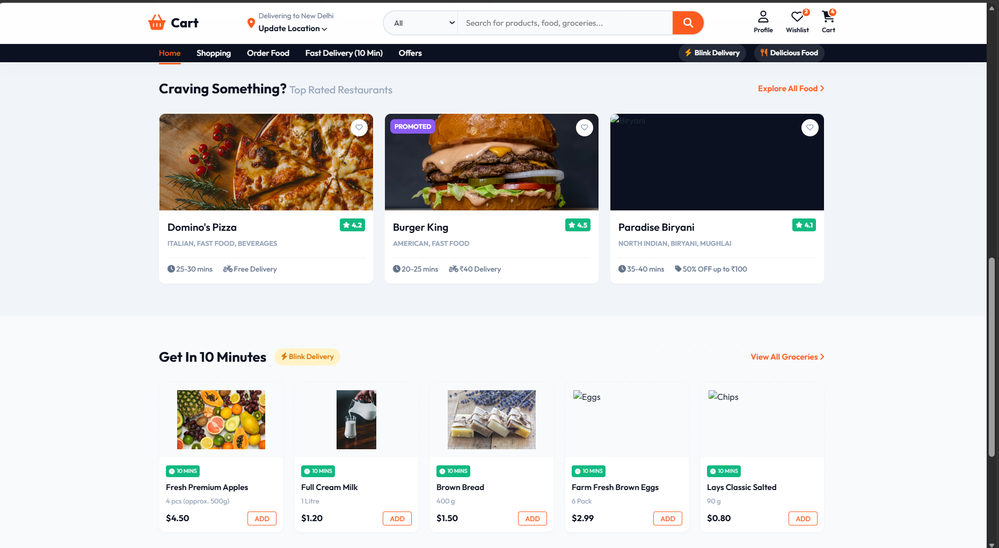

# 🛒 Cart - Multi Category E-Commerce Platform  

  A modern multi-category e-commerce web application 🛍️  

---

## 📌 Description  

This project is a **multi-category e-commerce platform** that allows users to browse products across different categories such as food 🍔 and clothing 👕, and manage their shopping cart efficiently.  

It focuses on delivering a **smooth user experience**, dynamic cart updates, and real-time price calculations.

---

## ✨ Features  

- 🔐 User Authentication (Login / Signup)  
- 🛍️ Browse products by category  
- 🧾 Dynamic cart system  
- 💰 Real-time price calculation  
- ⚡ Interactive and responsive UI  

---

## 🛠️ Tech Stack  

**Frontend:**  
- HTML  
- CSS  
- JavaScript  

**Backend & Database:**  
- MySQL  

**Tools:**  
- Git & GitHub  

---

## 📸 Screenshots  

  

  

---
